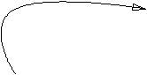

Shapes
======

Chiplotle comes with a variety of `primitive` shape constructors. 
A circle constructor takes at least a `radius` parameter::

   c = shapes.circle(1000) 

A rectangle constructor takes two parameters, a `width` and a `height`::

   r = shapes.rectangle(500, 1000)

.. note::

   The shapes module is loaded after running ``chiplotle`` from the terminal prompt, or calling ``from chiplotle import *`` in the Python interpreter.

There are many primitive shape constructors in Chiplotle.
To see all available shape constructors call ``dir()`` on the shapes module::

   dir(shapes)

To get information about a function call ``help()`` on it::

   help(shapes.circle)

Properties
-----------

Shapes have properties, like center, centroid, width, height, etc.::

   >>> c = shapes.circle(1000)
   >>> c.center
   Coordinate([0.0, 0.0])
   >>> c.width
   2000.0
   

Groups
------

Primitive shapes can be grouped to create more complex shapes::

   c = shapes.circle(1000)
   r = shapes.rectangle(500, 1000)
   g = shapes.group([c, r])

A group can be treated just like any other shape. It can be transformed and inserted into a higher level group.
Groups thus behave just like primitive shapes.

Examples
--------

A set of achs:

.. image:: images/arches.png

::

   g = shapes.group()
   for radius in range(100, 1000, 100):
      a = shapes.arc_circle(radius, 1.0, math.pi)
      gr.append(a)

.. note:: Remember that to view a shape you call ``io.view(arg)``, where `arg` is the shape object. Here we would execute ``io.view(gr)``.

An arrow:

::

   coords = [(0, 0), (0, 1000), (1000, 1000)]
   p = shapes.bezier_path(coords, 1)
   a = arrow(p, 100, 200)

Transforms
==========

Shapes can be transformed:

Offset::

   >>> c = shapes.circle(1000)
   >>> c.center
   Coordinate([0.0, 0.0])
   >>> transforms.offset(c, (100, 200))
   >>> c.center
   Coordinate([100.0, 200.0])

Scale::

   >>> c = shapes.circle(1000)
   >>> c.width
   2000.0
   >>> transforms.scale(c, 2.4)
   >>> c.width
   4800.0

Rotate::

   >>> r = shapes.rectangle(100, 200)
   >>> r.height
   200.0
   >>> transforms.rotate(r, 3.14 / 4)
   >>> r.height
   212.16017194397654

